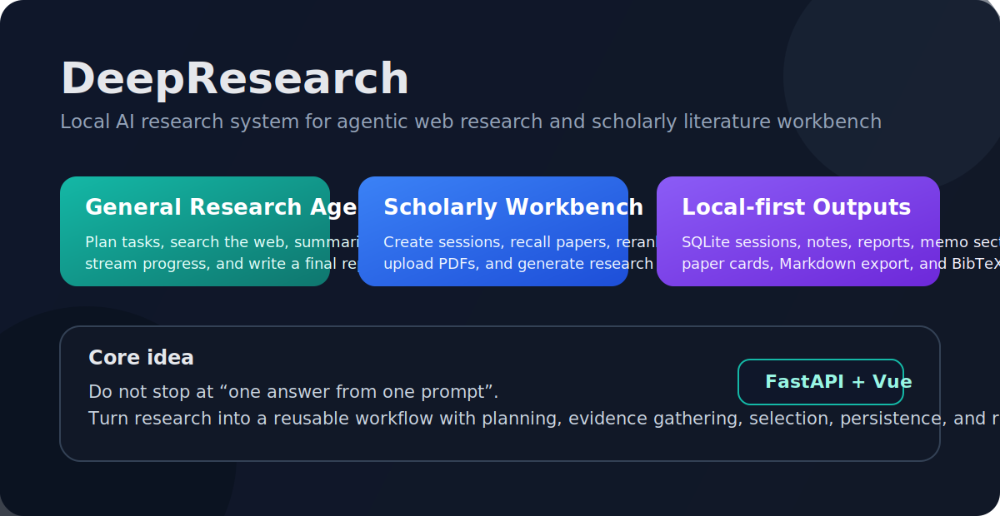
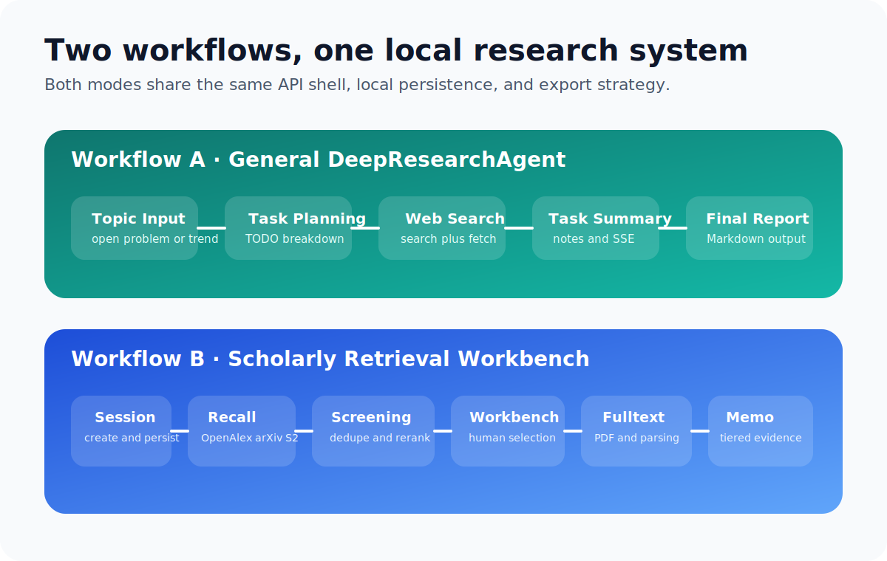
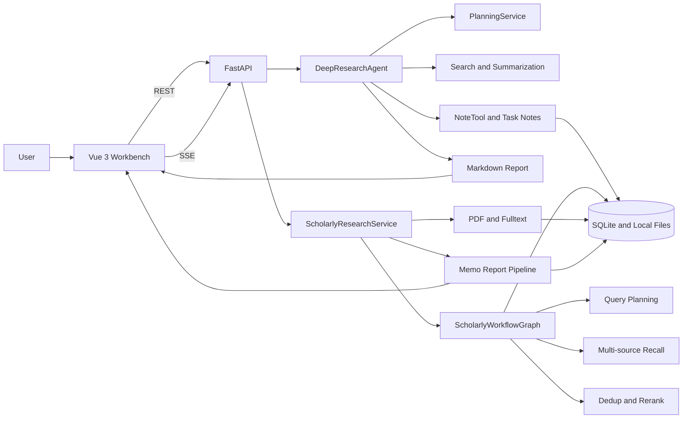
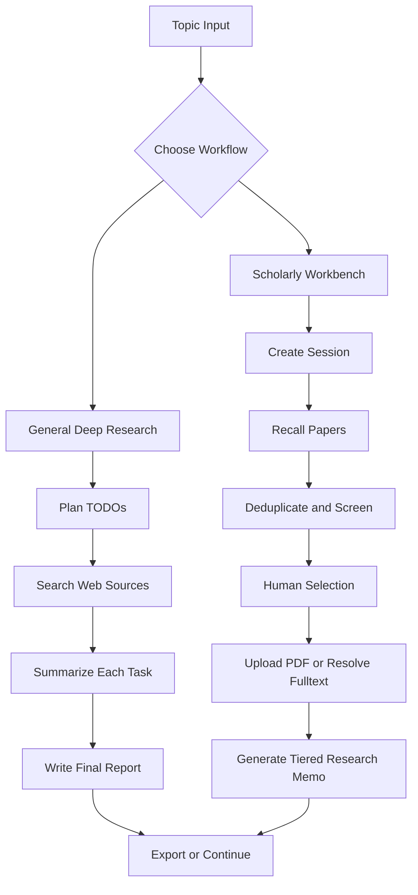

# DeepResearch

<p align="center">
  
  
  
  
  
</p>

<p align="center">
  一个面向研究工作流的本地 AI 系统：左手做通用 Web Research，右手做 AI/CS 文献调研工作台。
</p>

<p align="center">
  
</p>

`DeepResearch` 不是一个“问一句答一句”的聊天 Demo，而是把研究过程拆成了可持续复用的工作流：

- 对开放主题，系统会自动规划 TODO、搜索、总结、写报告，并通过 SSE 持续回传进度。
- 对论文调研，系统会创建 session，做多源召回、去重、重排、人工筛选、PDF 上传/全文解析、最终研究备忘录生成。
- 所有核心结果都尽量保存在本地：会话、论文池、报告、结构化 metadata、导出文件。

如果你只是想快速启动项目，直接看 [README.zh-CN.md](README.zh-CN.md)。  
如果你想把这个仓库作为公开作品集展示，这份 README 是首页版本。

## 项目定位

大多数 AI research demo 停在“模型给出一段答案”。

这个项目要解决的是另一类问题：当研究主题变复杂以后，怎么把“问题拆解、搜索、筛选、记录、回看、导出、继续迭代”做成一套真正能用的工作台，而不是一次性输出。

你可以把它理解成两条主工作流共用一套本地基础设施：

| 工作流 | 适用场景 | 核心输出 |
| --- | --- | --- |
| `DeepResearchAgent` | 开放式主题调研、趋势整理、任务拆解 | TODO、搜索过程、任务级总结、最终 Markdown 报告 |
| `Scholarly Retrieval Workbench` | AI/CS 论文综述、论文池管理、证据分层报告 | session、论文池、人工筛选状态、PDF/全文、研究备忘录、Markdown/BibTeX |

<p align="center">
  
</p>

## 核心能力

- `Agentic Web Research`：把一个主题先拆成若干 research tasks，再逐个检索、总结、汇总。
- `Streaming UX`：后端通过 SSE 推送任务状态、来源、增量总结和最终报告，前端可以实时展示全过程。
- `Scholarly Session Model`：论文调研不是一次性结果，而是一个可回访、可继续筛选、可派生子主题的 session。
- `Multi-source Paper Recall`：面向 AI/CS 论文，从 `OpenAlex`、`arXiv`、`Semantic Scholar` 进行多源召回。
- `Screening and Reranking`：对候选论文做去重、粗排、frontier fallback、终排，避免工作台直接被噪音论文淹没。
- `Tiered Research Memo`：报告不是泛化综述，而是区分 `core`、`adjacent_transfer`、`off_target` 三层证据来组织结论。
- `PDF and Fulltext Pipeline`：支持上传本地 PDF，抽取全文后再参与报告合成和证据强化。
- `Local-first Persistence`：使用 SQLite 保存 session、paper pool、report、metadata，便于继续研究和导出成果。
- `Export-friendly`：支持导出 Markdown 和 BibTeX，适合后续整理成综述、周报、笔记或项目材料。

## 技术栈

| 层级 | 技术 | 为什么用 |
| --- | --- | --- |
| Frontend | `Vue 3` + `TypeScript` + `Vite` | 单文件组件开发快，适合把研究工作台做成高交互前端 |
| Backend API | `FastAPI` + `Pydantic` | API 定义清晰，适合 SSE、结构化请求和本地服务化 |
| Workflow | `LangGraph` | 适合表达多阶段研究流程、可中断状态、节点式执行 |
| Storage | `SQLite` | 本地原型和个人研究工具的性价比很高，易分发、易备份 |
| LLM Access | `hello-agents` + `OpenAI-compatible APIs` | 兼容 Ollama、LMStudio 和其他 OpenAI 风格服务 |
| Retrieval | `requests` + scholarly source adapters | 方便打通 OpenAlex / arXiv / Semantic Scholar |
| PDF Parsing | `pypdf` | 支持本地上传 PDF 后抽取文本进入证据链 |
| Logging | `loguru` | 本地调试阶段比默认 logging 更直接 |

## 架构图



## 两条主流程怎么跑



## 你能在这个仓库里看到什么

### 1. 通用研究代理

- 入口在 [backend/src/agent.py](backend/src/agent.py)
- API 在 [backend/src/main.py](backend/src/main.py) 的 `/research` 和 `/research/stream`
- 典型过程是：
  1. 输入研究主题
  2. 生成 TODO tasks
  3. 搜索与抓取来源
  4. 任务级总结
  5. 汇总成最终报告

### 2. 学术文献工作台

- 入口在 [backend/src/services/scholarly_workflow.py](backend/src/services/scholarly_workflow.py)
- 主流程图在 [backend/src/services/scholarly_graph.py](backend/src/services/scholarly_graph.py)
- 报告合成在 [backend/src/services/scholarly_report_pipeline.py](backend/src/services/scholarly_report_pipeline.py)
- 前端工作台主界面在 [frontend/src/App.vue](frontend/src/App.vue)

这个模式下，系统会把论文调研看作一个完整 session，而不是一段文本输出：

- `create session`
- `generate query tasks`
- `multi-source recall`
- `dedupe + rerank`
- `manual include / exclude / save`
- `upload PDF / resolve fulltext`
- `generate memo report`
- `export markdown / bibtex`

### 3. 结构化研究备忘录

当前版本的 scholarly 报告，不是把所有命中论文直接混成一锅综述，而是显式分层：

- `core`：直接命中当前研究问题边界的关键论文
- `adjacent_transfer`：可迁移但不能直接并入主结论的邻近路线
- `off_target`：确认过但不参与主结论，只保留在附录和参考中

这让报告更像“辅助研究的工作底稿”，而不是泛泛的模型生成文案。

## 快速启动

### 环境要求

- `Python >= 3.10`
- `uv`
- `Node.js`
- 一个可用的 LLM 服务：`Ollama`、`LMStudio` 或其他 OpenAI-compatible endpoint

### 1. 安装后端依赖

```powershell
cd backend
uv sync
```

### 2. 安装前端依赖

```powershell
cd frontend
npm install
```

### 3. 配置环境变量

后端从 `backend/.env` 读取配置。常用字段见下表：

| 变量 | 作用 | 默认值 |
| --- | --- | --- |
| `LLM_PROVIDER` | LLM 提供方，支持 `ollama` / `lmstudio` / custom | `ollama` |
| `LOCAL_LLM` | 默认模型名 | `llama3.2` |
| `OLLAMA_BASE_URL` | Ollama 服务地址 | `http://localhost:11434` |
| `LMSTUDIO_BASE_URL` | LMStudio OpenAI-compatible 地址 | `http://localhost:1234/v1` |
| `SEARCH_API` | 搜索源 | `duckduckgo` |
| `SCHOLARLY_DB_PATH` | scholarly session 的 SQLite 路径 | `./scholarly_sessions.sqlite3` |
| `SCHOLARLY_ARTIFACT_DIR` | PDF 与全文产物目录 | `./scholarly_artifacts` |
| `SCHOLARLY_CANDIDATE_LIMIT` | 召回候选上限 | `50` |
| `SCHOLARLY_SELECTION_LIMIT` | 默认入选工作台论文数 | `20` |

### 4. 启动后端

```powershell
.\scripts\start-backend.ps1
```

后端地址：

```text
http://localhost:8000
```

### 5. 启动前端

```powershell
.\scripts\start-frontend.ps1
```

前端默认开发地址通常是：

```text
http://localhost:5173
```

## 常用接口

> 你不一定需要手动调用这些接口，但它们可以帮助你快速理解项目边界。

| 路径 | 用途 |
| --- | --- |
| `POST /research` | 运行一次通用研究代理 |
| `POST /research/stream` | 以 SSE 方式流式运行通用研究代理 |
| `POST /research/sessions` | 创建 scholarly research session |
| `POST /research/sessions/stream` | 流式创建 scholarly session |
| `PATCH /research/sessions/{id}/papers/{paper_id}` | 更新论文筛选状态 |
| `POST /research/sessions/{id}/papers/{paper_id}/pdf` | 上传本地 PDF |
| `POST /research/sessions/{id}/papers/{paper_id}/fulltext/resolve` | 触发全文解析 |
| `POST /research/sessions/{id}/report/stream` | 流式生成研究备忘录 |
| `GET /research/sessions/{id}/export.md` | 导出 Markdown |
| `GET /research/sessions/{id}/export.bib` | 导出 BibTeX |

## 仓库结构

```text
deepresearch/
├─ backend/
│  ├─ src/
│  │  ├─ agent.py
│  │  ├─ main.py
│  │  ├─ config.py
│  │  └─ services/
│  │     ├─ planner.py
│  │     ├─ search.py
│  │     ├─ summarizer.py
│  │     ├─ scholarly_graph.py
│  │     ├─ scholarly_search.py
│  │     ├─ scholarly_rerank.py
│  │     ├─ scholarly_fulltext.py
│  │     ├─ scholarly_report_pipeline.py
│  │     └─ scholarly_store.py
│  ├─ tests/
│  └─ pyproject.toml
├─ frontend/
│  ├─ src/
│  │  ├─ App.vue
│  │  └─ services/api.ts
│  └─ package.json
├─ docs/
│  ├─ scholarly-retrieval-tech-chain.zh-CN.md
│  └─ assets/
├─ scripts/
└─ README.md
```

## 验证命令

前端：

```powershell
cd frontend
npm run build
```

后端：

```powershell
cd backend
.\.venv\Scripts\python.exe -m pytest tests/test_scholarly_graph.py
```

## 当前更适合什么场景

适合：

- 个人研究助手
- AI/CS 论文综述准备
- 做成作品集展示的“研究工作流系统”
- 本地优先、不想一开始就上复杂云基础设施的原型

暂时不适合：

- 直接拿去做公网生产服务
- 把它当成严格的学术检索替代品
- 依赖全自动高质量综述且不愿意人工复核的场景

## 相关文档

- [README.zh-CN.md](README.zh-CN.md)：偏运行说明
- [docs/scholarly-retrieval-tech-chain.zh-CN.md](docs/scholarly-retrieval-tech-chain.zh-CN.md)：项目技术链拆解
- [docs/resume-tech-roadmap-v2.zh-CN.md](docs/resume-tech-roadmap-v2.zh-CN.md)：更偏项目包装和表达

## License

This repository is licensed under the [MIT License](LICENSE).
