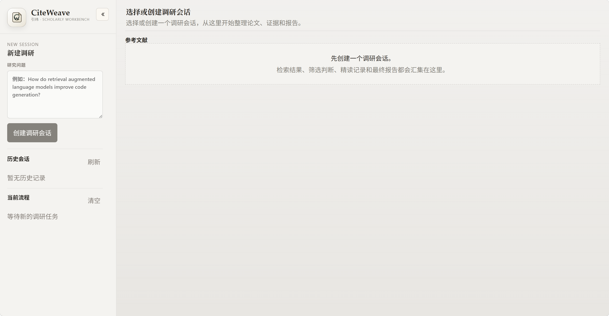

# CiteWeave

<p align="center">
  
  
  
  
  
</p>

<p align="center">
  A local-first scholarly workbench for paper retrieval, screening, close reading, and evidence memo synthesis.
</p>

<p align="center">
  一个面向 AI/CS 文献调研的本地研究工作台，强调持续筛选、证据整理和研究备忘录生成，而不是一次性回答。
</p>

[](docs/assets/readme-home.png)

## Overview

`CiteWeave` 把文献调研拆成一个可以反复回访的工作流：

- 从 `OpenAlex`、`arXiv`、`Semantic Scholar` 做多源召回
- 在工作台里人工筛选、标注、保留上下文
- 支持上传本地 PDF 和全文解析
- 基于确认论文生成结构化研究备忘录
- 导出 `Markdown` 和 `BibTeX`

它不是 PDF 管理器，也不是问答壳，而是一个偏研究过程管理的本地工具。

## Interface

主工作台把检索、筛选、精读和报告都收在同一个界面里，交互尽量克制，优先保留研究过程本身。

## What It Does

| Module | What it handles |
| --- | --- |
| `Session model` | 为每个研究主题创建可持久化会话，保留论文池、筛选状态、报告和导出物 |
| `Paper recall` | 面向 AI/CS 主题做 query planning、多源召回、去重和重排 |
| `Workbench review` | 在前端统一完成检索查看、人工纳入、标签判断和单篇精读 |
| `Fulltext pipeline` | 上传本地 PDF，抽取正文文本，增强报告期证据 |
| `Tiered memo` | 把论文分为 `core`、`adjacent_transfer`、`off_target`，避免把邻近任务混成同一结论 |
| `Exports` | 导出研究备忘录 Markdown 和 BibTeX，便于继续整理综述和笔记 |

## Workflow

### Scholarly workbench

1. 创建一个调研会话。
2. 系统生成 query tasks 并发起多源检索。
3. 候选论文进入去重、粗排和终排。
4. 用户在工作台里做 `include / exclude / save / to_read`。
5. 如有需要，上传 PDF 或解析全文。
6. 基于当前确认论文生成结构化研究备忘录并导出。

### General research agent

仓库里还保留一条更通用的 research workflow，用于开放式 web research：

- 主题拆解
- TODO 规划
- 搜索与抓取
- 任务级总结
- 最终 Markdown 报告

## Tech Stack

| Layer | Stack | Why |
| --- | --- | --- |
| Frontend | `Vue 3` + `TypeScript` + `Vite` | 适合快速构建高交互、本地优先的工作台界面 |
| Backend API | `FastAPI` + `Pydantic` | 清晰处理 REST、SSE 和结构化数据契约 |
| Workflow | `LangGraph` | 适合表达多阶段研究流程与状态流转 |
| Retrieval | `requests` + source adapters | 方便打通 `OpenAlex`、`arXiv`、`Semantic Scholar` |
| Persistence | `SQLite` | 适合个人研究工具的本地会话持久化 |
| Fulltext | `pypdf` | 用于本地 PDF 文本抽取 |
| LLM access | `hello-agents` + OpenAI-compatible APIs | 兼容 `Ollama`、`LMStudio` 等本地或自托管模型服务 |

## Run Locally

### Requirements

- `Python >= 3.10`
- `uv`
- `Node.js`
- 一个可用的 OpenAI-compatible LLM endpoint，或本地 `Ollama` / `LMStudio`

### Backend

```powershell
cd backend
uv sync
.\.venv\Scripts\python.exe -m uvicorn main:app --app-dir src --host 0.0.0.0 --port 8000 --reload
```

### Frontend

```powershell
cd frontend
npm install
npm run dev
```

默认本地地址：

- frontend: `http://localhost:5173`
- backend: `http://localhost:8000`

更详细的本地运行说明见 [README.zh-CN.md](README.zh-CN.md)。

## Key Endpoints

| Endpoint | Purpose |
| --- | --- |
| `POST /research` | 运行通用研究代理 |
| `POST /research/stream` | 以 SSE 方式流式运行通用研究代理 |
| `POST /research/sessions` | 创建 scholarly session |
| `POST /research/sessions/{id}/report/stream` | 生成研究备忘录 |
| `POST /research/sessions/{id}/papers/{paper_id}/pdf` | 上传本地 PDF |
| `POST /research/sessions/{id}/papers/{paper_id}/fulltext/resolve` | 解析全文 |
| `GET /research/sessions/{id}/export.md` | 导出 Markdown |
| `GET /research/sessions/{id}/export.bib` | 导出 BibTeX |

## Repository Layout

```text
scholarly-workbench/
├─ backend/
│  ├─ src/
│  │  ├─ agent.py
│  │  ├─ main.py
│  │  └─ services/
│  │     ├─ scholarly_graph.py
│  │     ├─ scholarly_search.py
│  │     ├─ scholarly_fulltext.py
│  │     ├─ scholarly_report_pipeline.py
│  │     └─ scholarly_store.py
│  └─ tests/
├─ frontend/
│  ├─ src/
│  │  ├─ App.vue
│  │  └─ services/api.ts
│  └─ public/
├─ docs/
│  └─ assets/
└─ scripts/
```

## Current Scope

适合：

- AI/CS 论文综述准备
- 个人研究助手
- 本地优先的 research workflow 原型
- 作为工程作品展示检索、工作台和报告生成能力

暂时不适合：

- 直接作为公网生产服务部署
- 替代严格的学术数据库检索
- 无人工复核地自动生成最终综述

## Related Docs

- [README.zh-CN.md](README.zh-CN.md): 运行说明与环境恢复

## License

This repository is licensed under the [MIT License](LICENSE).
